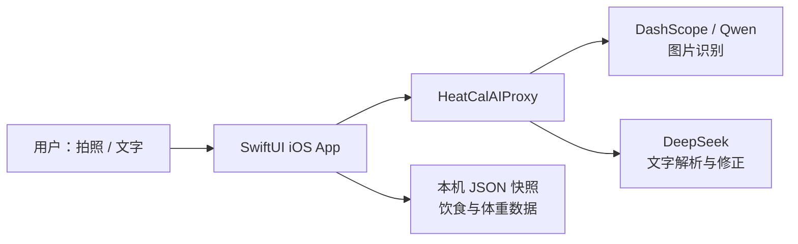

<p align="center">
  
</p>

<h1 align="center">热量咔 · HeatCal</h1>

<p align="center">
  <strong>一拍就记，吃得明白。</strong><br>
  面向减脂用户的 AI 饮食记录 iPhone MVP
</p>

<p align="center">
  
  
  
  
  
</p>

<p align="center">
  <a href="#产品亮点">产品亮点</a> ·
  <a href="#真实界面">真实界面</a> ·
  <a href="#技术架构">技术架构</a> ·
  <a href="#本地运行">本地运行</a> ·
  <a href="#项目文档">项目文档</a>
</p>

---

## 项目简介

热量咔是一款围绕「降低饮食记录负担」设计的 AI 饮食记录 App。它不要求用户先搜索食物、选择数据库条目再估算克数，而是用 **拍照优先、文字补记兜底、实际摄入可调整** 的方式完成记录。

这个项目不是一张停留在概念阶段的 UI 稿：它已经打通 iOS App、云端轻量代理、图片识别、文字解析、本机持久化和错误兜底，并经历多轮真机体验修订与自动化验证。

> 核心产品判断：AI 估算不需要假装绝对精确，但必须让用户看得懂、改得动、敢于保存。

## 真实界面

<table>
  <tr>
    <td align="center"><br><sub>今日概览</sub></td>
    <td align="center"><br><sub>拍照优先的记录入口</sub></td>
    <td align="center"><br><sub>自然语言补记</sub></td>
  </tr>
  <tr>
    <td align="center"><br><sub>体重趋势</sub></td>
    <td align="center"><br><sub>设置与数据隐私</sub></td>
    <td align="center"><a href="https://shawnlin599.github.io/HeatCal/assets/demo/heatcal-demo.mp4"><br><sub>▶ 查看真实 App 演示</sub></a></td>
  </tr>
</table>

## 产品亮点

### 1. 拍照优先，文字兜底

- 相机作为最高频主入口，减少记录步骤。
- DashScope/Qwen 识别图片中的食物、份量与营养估算。
- 不方便拍照时，可直接输入「早餐吃了一个鸡蛋和一碗米饭」。

### 2. 实际摄入可调整

照片里的食物不等于实际吃下的食物。热量咔允许用户逐项修改实际摄入量，也支持自然语言修正，例如「鸡蛋吃了一半，米饭全部吃完」。

### 3. 不确定性可见、结果可修正

- 显示估算范围与置信度，不制造虚假精确。
- 识别结果可以编辑、删除或重新分析。
- Provider 故障时采用统一错误模型，并明确区分真实 AI 与 fallback。

### 4. 隐私优先的 MVP 数据策略

- 饮食记录、体重与目标保存在本机。
- iOS App 不持有 Provider API Key。
- 原始食物照片不在 App 内长期保存。
- 用户可删除单条记录或清空全部本机数据。

## 技术架构



| 层级 | 技术 | 职责 |
| --- | --- | --- |
| iOS 客户端 | Swift 6、SwiftUI、URLSession | 拍照、补记、确认、摄入调整、趋势与本机持久化 |
| AI 代理 | Python 标准库 HTTP 服务 | 隐藏密钥、调用 Provider、校验响应、归一化错误 |
| 图片理解 | DashScope / Qwen | 食物识别与结构化营养估算 |
| 文字理解 | DeepSeek | 自然语言补记和实际摄入修正 |

## 项目结构

```text
HeatCal/
├── ios/HeatCalMockApp/       # SwiftUI iOS App 与 XCTest
├── backend/                  # 最小 AI Provider 代理
├── tests/                    # 后端契约单元测试
├── docs/                     # PRD、交互设计、技术说明与案例复盘
└── assets/                   # 真实截图与演示视频
```

## 本地运行

### 环境要求

- macOS + Xcode 16 或更高版本
- iOS 17+ 模拟器或真机
- Python 3.10+
- DashScope 与 DeepSeek API Key（仅真实 AI 链路需要）

### 1. 启动 AI 代理

```bash
cp backend/.env.example .env.local
# 在 .env.local 中填写自己的 Provider Key
python3 -m backend.heatcal_proxy --env-file .env.local
```

代理默认仅监听本机回环接口，监听端口可通过环境变量配置。环境变量和 API 合约见 [backend/README.md](./backend/README.md)。

### 2. 运行 iOS App

```bash
open ios/HeatCalMockApp/HeatCalMockApp.xcodeproj
```

在 Xcode 中选择 `HeatCalMockApp` scheme 和任意 iOS 17+ 模拟器运行。公开版默认连接本机代理；真机联调时可在 App 的高级设置中填写 Mac 的局域网地址。

### 3. 运行测试

```bash
python3 -m unittest discover -s tests -p 'test_*.py' -v
```

```bash
xcodebuild \
  -project ios/HeatCalMockApp/HeatCalMockApp.xcodeproj \
  -scheme HeatCalMockApp \
  -destination 'platform=iOS Simulator,name=iPhone 17 Pro' \
  test
```

## 验证证据

公开版本发布前已在 iPhone 17 Pro 模拟器和本地 Python 环境重新验证：

| 验证范围 | 结果 |
| --- | --- |
| Swift / XCTest | 33 项通过 |
| Python 后端契约测试 | 9 项通过 |
| Provider Key 与私钥模式扫描 | 未发现真实凭据 |
| 单文件大小检查 | 无文件超过 GitHub 50 MiB 安全阈值 |

## 项目文档

- [产品需求文档（PRD）](./docs/product-requirements.zh-CN.md)
- [交互与视觉方案](./docs/design-spec.zh-CN.md)
- [真实 AI 后端接入说明](./docs/backend-integration.zh-CN.md)
- [完整作品集案例复盘](./docs/case-study.zh-CN.md)

## 当前阶段与边界

当前版本是可运行、可测试、可继续推进 TestFlight 的作品集 MVP，但不是已正式上架的医疗或营养产品：

- 尚未进入 App Store 正式发布；
- 暂无规模化留存或商业转化数据；
- AI 营养估算准确率仍需通过标注数据集验证；
- 结果仅用于饮食记录参考，不构成医疗建议。

## English summary

**HeatCal** is an AI-assisted food logging iPhone MVP designed to reduce the friction of calorie tracking. It combines photo-first logging, natural-language fallback, editable intake adjustments, a key-safe provider proxy, and local-first data storage. The repository documents the product decisions, real implementation, validation evidence, and honest product limitations behind the prototype.

## 作者与说明

该项目由 **ShawnLin599** 主导产品定义、体验取舍、项目管理与 AI 协作式实现，用于展示从问题发现、MVP 设计到真实 AI 链路和质量验证的完整产品过程。

本仓库以作品集展示和技术交流为目的。除非另有书面许可，代码与视觉资产未授予开源再分发许可。
