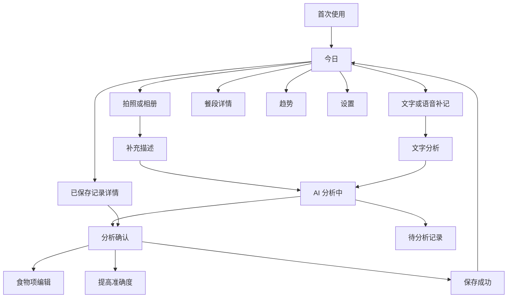
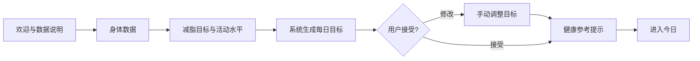
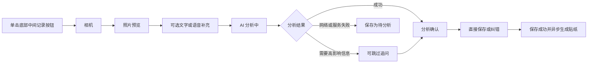

# 热量咔 iOS MVP 交互与视觉方案

- 关联任务：`CAL-20260613-003`
- 产品基线：`docs/product-requirements.zh-CN.md`
- 补充产品规则：`文档/产品/产品规则-实际摄入量调整-v1.0.md`
- 方案版本：v1.0
- 日期：2026-06-14
- 状态：待用户审阅
- 平台：iPhone
- 视觉概念稿：`assets/design/core-flow.svg`
- 实际渲染预览：`assets/design/core-flow.png`
- 实际摄入调整概念稿：`assets/design/intake-adjustment.svg`
- 实际摄入调整渲染预览：`assets/design/intake-adjustment.png`

## 0.1 视觉概念稿修订记录

- v1.1：修正今日页摘要卡中营养进度与进度环重叠。
- v1.1：统一主要按钮、次级按钮与导航标题的居中锚点，消除手工估算字宽导致的偏移。
- v1.1：增加分析确认页顶部摘要安全间距，并将纠错入口移离 Home Indicator。
- v1.1：校正餐段汇总、底部导航和待分析操作区域的右侧边界与文字间距。
- v1.2：根据用户决定统一记录入口，移除今日页右上角“+”和页面内“拍照记录”按钮。
- v1.2：底部中间“记录”按钮调整为唯一突出入口，并补充点击、长按和上滑规则。
- v1.3：统一目标确认与今日摘要圆环的视觉重量为 `13pt` 描边，并以圆心锚点校正圆环内文字。
- v1.4：将今日摘要圆环内百分比提升为 `16pt / Bold` 强调数字，保持低于主热量数字的视觉层级。
- v1.5：增强今日页营养进度可读性，补充营养素名称、已摄入值和目标值。
- v1.5：新增今日页右上角设置入口；将首次记录教学改为依附底部按钮的一次性气泡。
- v1.5：强化分析确认页不确定性信息块与自然语言纠错入口；收敛待分析卡片的重复警示样式。
- v1.6：自然语言纠错入口改为“麦克风 + 修正笔”组合标识与“语音修正结果”动作标签。
- v1.6：压缩首次目标确认页健康提示卡高度，图标与标题同排，保持完整健康参考、估算和非医疗建议语义。
- v1.7：补充“趋势 / 体重”概念画板，明确底部右侧“趋势”入口，并展示最近 30 天简单体重趋势、当前/目标体重及今日体重录入。
- v1.8：统一今日、待分析和趋势页底部导航的容器基线、三栏中心线与选中态布局。
- v1.9：统一三行说明卡的行距与底部安全间距，并校正“记录今日体重”、底部记录入口和趋势选中态的图标文字视觉中心。
- v2.0：校正分析确认页返回与更多操作的图标文字中心；将待分析页标题改为“记录已保存，等待分析”并统一顶部垂直节奏；为“今日”选中态补充与“趋势”对称的图标胶囊。
- v2.1：统一底部导航所有选中与未选中文字的水平中心线；将网络异常图标与标题行对齐；对圆环百分比做光学居中并验证 `1% / 58% / 120%` 字符宽度。
- v2.2：对分析确认页返回箭头单独进行光学上移，使箭头与“返回”中文字形视觉中心对齐。
- v2.3：优化首次目标确认卡右侧信息组，统一数值、单位和生成依据的左边界并收紧垂直节奏；预留不同位数目标值的稳定展示空间。
- v2.4：调整今日摘要卡三大营养素组的垂直位置与组内行距，使其与“已摄入”信息及卡片底边形成更均衡的上下留白。
- v2.5：将确认页整餐估算值改为自适应连续信息组，优化“约 / 数字 / 千卡”的间距与数字光学中心并验证不同位数；缩小并下移网络异常图标，使其与三行提示文案整体视觉居中。
- v2.6：优化体重趋势页的动作与分区命名，将页面内操作改为“添加今日体重”、历史分区改为“体重历史”，图表说明改为明确的体重数据表述并验证不同天数宽度。
- v2.7：统一体重趋势图横坐标日期的垂直基准，使左、中、右日期标签处于同一水平视觉中心线，并验证较宽月份日期的安全边界。
- v2.8：将体重趋势图横坐标日期整排上移，收紧日期与图表主体的距离，并重新平衡日期与下方数据说明的垂直节奏。
- v2.9：修复分析确认页返回箭头的视觉对齐回归；将返回箭头与文字固化为组合控件，并收敛箭头光学上移补偿。
- v3.0：基于日常 iOS 返回控件观感重新校正返回箭头，取消上移补偿并略增箭头横向体量，使图标与“返回”文字共享视觉中心。
- v3.1：依据实际摄入量规则澄清，将整餐比例明确为应用到全部食物的批量快捷操作，补充非强制逐项调整入口、识别/实际份量摘要及文字/语音逐项修正入口。
- v3.2：收敛分析确认页实际摄入入口，主层级仅保留“保存记录”和“有剩余？调整实际摄入”；将批量比例、逐项控件、文字/语音修正和同名项澄清 Sheet 归入实际摄入调整页。
- v3.3：优化确认页底部辅助信息组，将实际摄入入口与用餐时间合并为一张轻量卡；优化实际摄入调整页数值组、选项胶囊内边距、加减按钮居中和 Sheet 底部安全区，并验证 `1 / 10 / 1,000` 千卡及 `10 个 / 1,000 千卡` 压力场景。
- 实际摄入 v1.3：微调实际摄入调整页数值组光学基线、米饭与宫保鸡丁行内垂直节奏、超过识别份量确认按钮文字中心，以及澄清 Sheet 说明文字与候选项间距。
- 实际摄入 v1.4：将实际摄入调整页顶部汇总数值组改为“约 / 数字 / 单位”独立文本定位，单独上移数字光学中心，修复大号数字下坠感。
- 实际摄入 v1.5：回调顶部汇总数字高度并收紧数字与“千卡”的水平间距，使“约 490 千卡”作为一个整体更协调。
- v3.4 / 实际摄入 v1.6：最后一轮轻量收敛，确认页弱化食物项右侧箭头为“查看”以表达单项查看/编辑，将实际摄入入口明确为“有剩余？进入实际摄入调整”；实际摄入页将“批量操作”改为“整餐一起调整”，差值标签改为“比识别少 130 千卡”，并统一黄色风险卡内次级按钮层级。
- v3.5 / 实际摄入 v1.7：放大分析确认页与实际摄入调整页的调整/滑杆语义图标，统一为更清晰的 26pt 圆形容器和更粗滑杆线条，保持图标与文字视觉中心对齐。

> 本方案只定义已批准 MVP 范围内的信息架构、用户流程、交互状态、视觉规范和设计交付说明，不改变产品范围或验收标准。

## 1. 设计结论

推荐采用 **“温暖饮食日记 + 快速拍照记录”** 方向。

核心体验承诺：

> 首页一眼知道今天还能吃多少；拍照后优先确认整餐结果，必要时再逐项纠错；所有不确定性清楚但不打断记录。

设计重点：

1. 底部中间“记录”按钮是全局唯一突出记录入口，单击直接进入拍照。
2. 今日页先呈现“剩余热量、营养进度、餐段记录”，不制造单日数字焦虑。
3. 分析确认页默认展示可快速保存的摘要，详细编辑按需展开。
4. 可信度、估算范围和误差来源始终可见，但使用中性提示而非警报式表达。
5. 整餐贴纸承担记录完成后的情绪反馈，营养数据承担判断价值，两者不互相遮挡。
6. AI 或网络失败时优先保护用户输入，明确区分“待分析”与正式记录。

## 2. 视觉方向探索

### 方向 A：营养仪表盘

- 特征：大面积图表、数字和进度环，偏专业健身工具。
- 优点：摄入与目标关系清晰，信息密度高。
- 风险：容易造成压迫感；贴纸和饮食日记的情绪价值较弱。

### 方向 B：温暖饮食日记（推荐）

- 特征：奶油色背景、珊瑚色品牌强调、餐食贴纸、圆角卡片、克制的数据图表。
- 优点：兼顾持续记录意愿与营养判断，适合减脂但不鼓励极端节食。
- 风险：需保持卡片层级清楚，避免页面过于可爱而削弱可信度。

### 方向 C：极简相机工具

- 特征：打开即拍、分析后立即保存，历史与趋势弱化。
- 优点：记录链路最短。
- 风险：无法充分承载今日汇总、历史修改、体重趋势和多条记录管理。

### 最终组合

以方向 B 为主体，吸收方向 C 的快速记录入口和方向 A 的清晰数据表达。视觉亲和，但交互与数据呈现保持克制、可信。

## 3. 品牌与视觉表达

### 3.1 品牌性格

- **轻松**：减少传统饮食记录的操作负担。
- **诚实**：明确告诉用户结果是估算，并解释误差。
- **有掌控感**：AI 结果始终可修改、删除或重新分析。
- **不评判**：避免“超标失败”“吃错了”等带有羞耻感的表达。

建议品牌短句：

> 一拍就记，吃得明白。

短句仅用于欢迎页和宣传表达，不替代“营养数据为估算、非医疗建议”的必要提示。

### 3.2 色彩

| 角色 | 色值 | 用途 |
| --- | --- | --- |
| Cream 50 | `#FFF8F2` | 全局暖色背景 |
| Surface | `#FFFFFF` | 卡片、弹层 |
| Ink 900 | `#24211F` | 主文字、关键数字 |
| Ink 600 | `#6E6560` | 次级说明 |
| Coral 500 | `#FF6B4A` | 品牌强调、选中态、贴纸装饰 |
| Coral 700 | `#B83B25` | 主要按钮底色，搭配白字 |
| Mint 100 | `#DDF3E8` | 正向状态背景 |
| Mint 700 | `#2F7558` | 正向文字、成功状态 |
| Amber 100 | `#FFF1C7` | 一般可信、待处理背景 |
| Amber 800 | `#795614` | 一般可信、待处理文字 |
| Red 100 | `#FCE3E1` | 错误背景 |
| Red 700 | `#A63D36` | 错误文字与破坏性操作 |
| Protein | `#6878D8` | 蛋白质进度 |
| Carbohydrate | `#D69B2D` | 碳水进度 |
| Fat | `#C66883` | 脂肪进度 |

规则：

- `Coral 500` 用作视觉强调，不承载白色小字号正文。
- 主要操作使用 `Coral 700`，保证白字可读性。
- 营养素颜色必须同时配文字标签，不只依赖颜色区分。
- 超过目标时维持中性说明，不把进度条整体变红。

### 3.3 字体与数字

- 使用 iOS 系统字体 `SF Pro`，支持动态字体。
- 页面标题：`28pt / Semibold`
- 卡片标题：`17pt / Semibold`
- 正文：`15pt / Regular`
- 辅助说明：`13pt / Regular`
- 关键热量数字：`34pt / Bold`，使用等宽数字特性。
- 圆环百分比：使用等宽数字、圆心锚点与轻微光学上移；至少验证 `1%`、`58%`、`120%` 三种宽度，字符增加时不得改变圆心或挤压圆环。
- 目标热量卡：数值、单位和生成依据使用固定左边界，不随数值宽度移动；至少验证 `1`、`20`、`180`、`1,820`、`11,020`，不同位数不得挤压单位、说明或卡片边界。
- 整餐估算值：“约 / 数字 / 千卡”组成连续自适应信息组，数字变化时单位随内容自然移动；主数字相对两侧小字轻微光学下移；至少验证 `6`、`20`、`1,110`，三段间距不得粘连、松散或越过卡片安全边界。
- 返回控件：箭头与“返回”文字作为同一组合维护，使用共享视觉中心；箭头横向体量需与中文字协调，图标至文字起点保持约 `7px`；以手机实际尺寸观感为主、放大局部用于排查，修改顶部导航时不得联动移动页面标题或更多按钮。
- 最小正文不低于 `13pt`；按钮文字不低于 `15pt`。

### 3.4 圆角、间距与层级

- 页面水平边距：`16pt`
- 基础间距单位：`4pt`
- 卡片内边距：`16pt`
- 卡片圆角：`20pt`
- 输入框、信息条圆角：`14pt`
- 标签胶囊圆角：`999pt`
- 卡片间距：`12pt`
- 页面区块间距：`24pt`
- 阴影仅用于底部中间全局记录按钮和底部操作区，普通卡片使用边框或背景层级。

### 3.5 图像与贴纸

- 带照片记录优先展示整餐贴纸，建议白边厚度约为图像短边的 `5%–7%`。
- 贴纸统一使用轻微顺时针或逆时针旋转，角度不超过 `3°`。
- 贴纸失败时展示 `16pt` 圆角原图，不显示错误提示打断用户。
- 无照片记录使用简洁食物线性图标，并显示“文字记录”标签。

## 4. 信息架构

### 4.1 一级导航

采用两个一级 Tab、一个居中的全局记录按钮，并从今日页右上角进入设置：

| 入口 | 内容 | 说明 |
| --- | --- | --- |
| 今日 | 每日汇总、餐段记录、日期切换 | 默认首页 |
| 记录 | 拍照、相册、文字、语音入口 | 居中强调按钮，不作为独立内容页 |
| 趋势 | 体重录入与简单趋势 | 不扩展复杂健康分析 |
| 设置 | 目标、记录模式、数据与隐私 | 从今日页右上角设置入口进入；隐藏开发者入口位于关于页 |

底部中间“记录”按钮是全局唯一突出记录入口，今日页不再提供右上角“+”或页面内记录按钮。

“今日”和“趋势”的选中态均使用浅色“图标 + 文字”胶囊并左右对称；居中的“记录”按钮始终保持主要操作样式，不承担当前页面选中态。

底部导航所有选中态、未选中态和全局记录按钮的图标文字组合共享同一水平视觉中心线；状态变化不得造成文字上下跳动。

- 单击：直接打开相机，服务最高频的拍照记录路径。
- 长按或向上滑动：展开记录方式菜单，展示“拍照”“从相册选择”“文字补记”“语音补记”。
- 展开后点击空白区域或向下滑动：关闭菜单并返回当前页面。
- 首次进入今日页时，可在底部按钮上方展示一次轻量提示：“点击拍照，长按查看更多方式”；用户操作后不再常驻。
- 相机权限被拒绝时，单击按钮改为展开记录方式菜单，并在菜单中说明相机权限状态。

### 4.2 页面层级

## 5. 核心用户流程

### 5.1 首次使用

交互规则：

- 采用四步流程，顶部显示进度，不一次展示长表单。
- 身体与目标数据使用数字键盘、单位后缀和合理范围提示。
- 生成结果页先解释“这是建议起点，可随时修改”，再展示数值。
- 数据仅保存在本机、卸载或换机会丢失的说明必须在完成前明确展示。
- 用户必须确认非医疗建议提示后进入首页。

### 5.2 拍照记录

快速路径目标：

`拍照 → 使用照片 → 分析确认 → 保存`

除系统相机操作外，成功结果到保存最多需要一次确认点击。

### 5.3 文字或语音补记

- 长按或向上滑动底部中间“记录”按钮，从展开菜单选择“文字补记”或“语音补记”。
- 输入区示例文案：“昨晚加餐吃了一个苹果”。
- 分析后将识别出的日期、时间和餐段作为可点击标签展示。
- 如果识别出未来日期，阻止保存并提示修改为今天或过去日期。
- 无照片记录使用默认图标，不生成贴纸。

### 5.4 分析确认与纠错

分析确认页分三层：

1. **立即判断层**：整餐热量、三大营养素、可信度、范围、主要误差来源。
2. **快速保存层**：食物项摘要、非强制入口“有剩余？进入实际摄入调整”、日期时间和餐段。
3. **详细调整层**：逐项实际摄入、食物项编辑、整餐一起调整次级操作、文字或语音自然语言纠错、补拍营养成分表、重新拍照、重新分析。

默认每项实际摄入量等于 AI 识别份量，用户可不进入调整流程直接保存。确认页展示食物项的“识别份量 / 实际摄入量”摘要，并提供非强制入口“有剩余？进入实际摄入调整”；用户点击食物项可查看或编辑单项，点击该入口则进入整餐实际摄入调整。

分析确认页不展示整餐比例快捷条，也不把文字 / 语音修正做成与保存、餐段、实际摄入入口并列竞争的主层级控件。整餐一起调整和自然语言修正只在实际摄入调整页或右上角更多菜单的弱入口中出现。

### 5.5 一餐多次记录

- 今日页按早餐、午餐、晚餐、加餐分组。
- 餐段卡片默认展示汇总值、记录数量与最多三张贴纸。
- 点击餐段卡片展开其下多条独立记录。
- 每条记录分别编辑、删除或重新分析，餐段汇总实时更新。
- “复制上一餐”和“复制昨日同餐”位于餐段操作菜单，复制完成后必须进入确认页。

## 6. 核心页面规格

### S01 欢迎与数据说明

- 品牌图形与“一拍就记，吃得明白”。
- 三条价值说明：拍照记录、结果可改、诚实估算。
- 明确说明本机保存、云端 AI 分析、卸载或换机会丢失数据。
- 主按钮：“开始设置”。
- 次入口：“查看数据与隐私说明”。

### S02 身体数据与目标

- 分步填写性别、年龄、身高、当前体重、目标体重、活动水平。
- 每步只聚焦一个问题；可返回修改。
- 输入不合理时就地提示，不清空用户输入。

### S03 每日目标确认

- 展示建议热量和三大营养素目标。
- 显示“建议起点，可随时调整”。
- 提供“使用建议目标”和“手动修改”。
- 安全下限触发时，不展示危险建议值，改为中性说明并引导合理调整。
- 底部展示非医疗建议确认。

### S04 今日页

从上至下：

1. 日期切换与“今天”回跳。
2. 剩余热量主卡：剩余值、已摄入/目标、柔和环形进度。
3. 三大营养素进度，分别展示名称、已摄入值和目标值。
4. 早餐、午餐、晚餐、加餐卡片。
5. 当日没有记录时的轻量空状态，提示用户点击底部“记录”按钮开始。
6. 底部中间“记录”按钮是页面唯一突出记录入口；今日页右上角仅放置设置入口，不放置重复记录入口。

餐段卡片：

- 折叠态：餐段名称、汇总热量、记录数量、贴纸预览、展开按钮。
- 展开态：独立记录列表、添加记录、复制操作。
- 待分析记录使用普通浅色边框和“待分析，不计入汇总”标签展示，避免与顶部网络状态形成重复警示。

### S05 相机与照片预览

- 使用系统相机界面，拍摄后进入照片预览。
- 照片预览页提供重拍、使用照片、添加描述、语音补充。
- 包装食品识别后，在分析确认页提示补拍营养成分表，不在拍摄前要求用户分类。

### S06 AI 分析中

- 展示照片缩略图和阶段文案：
  - 正在识别食物；
  - 正在估算份量；
  - 正在计算营养。
- 不展示虚假精确的百分比进度。
- 超过约 8 秒后提示“可以离开此页，完成后会保留结果”。
- 网络中断时立即提供“保存为待分析”和“重试”。

### S07 分析确认

顶部摘要卡：

- `约 620 千卡`
- 蛋白质、碳水、脂肪
- `一般可信`
- `可能范围 520–760 千卡`
- `主要误差：炒菜用油量未知`

中部：

- 食物项列表，每项展示名称、识别份量、实际摄入量、热量和弱“查看”入口；该入口表示查看或编辑单个食物项。
- 非强制入口“有剩余？进入实际摄入调整”，表示进入整餐实际摄入调整页，不点击时不影响直接保存。
- 日期、时间、餐段元数据。
- 不在主层级展示整餐比例快捷条，避免用户误解其与逐项食物的联动关系。
- “有剩余？进入实际摄入调整”和日期餐段可合并为同一辅助信息组，上下两行之间使用轻分隔线；食物项弱“查看”与该入口需在文案和视觉层级上区分，避免形成多个同级主入口。
- “有剩余？进入实际摄入调整”入口左侧使用调整/滑杆语义图标，实际渲染下需达到可读尺寸，不得退化成装饰点。

底部：

- 固定主要按钮“保存记录”。
- 文字 / 语音修正不与保存、餐段或实际摄入入口并列；用户进入实际摄入调整页后可使用“文字 / 语音逐项修正”，右上角更多菜单可保留弱入口。
- 更多菜单：文字 / 语音修正、补拍营养成分表、重新拍照、重新分析。

### S08 食物项编辑

- 实际摄入调整页承载复杂能力：顶部显示整餐汇总变化，中部逐项调整，“整餐一起调整”作为次级或可折叠操作。
- “整餐一起调整”副文案保留“会应用到全部食物，可再单独修改”的含义；展开后可选择全部、常用比例或其他比例，执行前说明会影响全部食物项。
- 整餐一起调整入口不得使用容易被理解为新增食物的红色加号图标，优先使用展开、比例、滑杆或类似批量调整语义的图标，并保证图标与文字共享视觉中心。
- 整餐一起调整图标与确认页实际摄入入口图标保持一致的基础尺寸、线宽和视觉中心，页面内可通过颜色保持次级层级。
- 逐项展示 AI 识别份量与实际摄入量；默认实际摄入量等于识别份量。
- 实际摄入优先提供自然数量或自然份量，例如鸡蛋 `2 个 → 1 个`、米饭 `1 碗 → 半碗`；无法自然表达时提供比例和自定义数量。
- 每个食物项都必须提供可理解的调整控件：自然数量用 `− / 数量 / +`，自然份量用可选项，混合菜可用比例或自定义；不得只显示一个不可操作感强的胶囊。
- 食物项热量读数与调整控件分区展示：热量优先放在食物行头右侧，调整控件放在下一行，避免 `10 个`、`1,000 千卡` 等压力场景挤压加减按钮。
- 实际摄入页数值组采用同行自适应布局，`约`、数字、单位共享基线，数字使用等宽数字特性；至少验证 `1`、`10`、`1,000` 千卡。
- 食物项内“识别份量”与下方控件需保持明确垂直间距；自然份量和比例选项行参考自然数量行的呼吸感，避免按钮贴近说明文字。
- 确认页食物项摘要至少验证长食物名、`12.5 份 → 10.5 份`、四位数热量和放大辅助文字；内容增长不得遮挡进入箭头或挤出卡片边界。
- 可编辑名称、识别数量、自然单位、单位大小、实际摄入量和营养数据。
- 删除使用破坏性颜色并二次确认。
- 单项实际摄入变化后立即更新该项与整餐汇总；整餐一起调整后允许单项覆盖，单项覆盖不影响其他食物。
- 支持“未食用 / 0”；该项保留在识别列表中但不计入汇总。
- 实际摄入超过识别份量时提示确认，但允许继续保存。
- 黄色风险卡内操作统一为清晰的次级按钮层级，确认与继续修改均需具备可点击感、文字视觉居中和足够触控面积。
- 文字 / 语音逐项修正位于实际摄入调整页内，解析结果在应用前可见、可修改。
- 同名或相似食物项无法定位时，不作为常驻模块展示；仅在文字 / 语音修正无法定位目标项时弹出 Sheet，让用户选择目标项或取消。
- 澄清 Sheet 底部取消动作不得贴近系统 Home Indicator，保留足够底部安全间距，降低误触风险。
- 澄清 Sheet 的说明文字与首个候选项之间保留清晰间距，避免用户误认为说明文字属于候选项按钮的一部分。
- 基础编辑不触发 AI；自然语言纠错和重新分析明确提示会重新分析。

### S09 可跳过追问

- 使用底部 Sheet，一次只问一个高影响且容易回答的问题。
- 选项直接可点，例如“中杯 / 大杯 / 不确定”。
- 始终提供“跳过，使用当前估算”。
- 快速模式只在严重影响结果时出现；精确模式可更主动出现。

### S10 待分析记录

- 页面标题使用“记录已保存，等待分析”，优先说明当前状态与下一步；顶部状态卡再解释网络不可用等具体原因。
- 保留照片或原始文字、日期时间和餐段。
- 使用普通浅色卡片与 Amber 标签：“待分析，不计入今日汇总”；顶部状态卡已经说明网络问题，不重复使用虚线警示边框。
- 提供“重试分析”“编辑描述”“删除”。
- 网络恢复时可提示重试，但不自动把未经确认的结果计入汇总。

### S11 已保存记录详情

- 展示贴纸或降级缩略图、营养摘要、可信度、误差来源和食物项。
- 支持修改摄入比例、编辑、删除、更换餐段、重新分析。
- 重新分析前提示：“会生成新结果，保存前不会覆盖当前记录。”

### S12 趋势

- 默认展示最近 30 天简单体重趋势。
- 顶部展示当前体重和目标体重；目标体重仅作为用户设定值展示。
- 页面中部在今日未录入时提供“添加今日体重”主要操作，今日已有数据时显示“更新今日体重”；底部右侧“趋势”入口进入该页面并显示选中状态。
- 图表必须有日期和数值辅助信息，支持 VoiceOver 读取趋势摘要。
- 横坐标左、中、右日期标签使用同一垂直基准，并与图表主体保持紧密但不重叠的视觉关系；水平锚点可分别使用左对齐、居中和右对齐，但不得造成日期文字上下跳动；至少验证较宽的 `12/16`、`12/20`、`12/31`、动态字体和较低折线点，日期不得挤出图表安全边界或与折线重叠。
- 图表说明使用“包含 N 天体重数据 · 点击数据点查看详情”，至少验证 `9`、`10`、`100`、`1,000` 天；数值增长不得挤压卡片边界或通过缩小字号解决。
- 图表只连接已有体重记录，不补齐缺失日期、不进行预测。
- 不提供医疗判断、预测、复杂健康建议或 Apple Health 接入。

### S13 设置

- 身体数据与减脂目标。
- 每日热量与三大营养素目标。
- 默认记录模式：快速 / 精确。
- 数据与隐私：本机保存说明、云端 AI 说明、删除全部数据。
- 关于：版本号、营养估算与非医疗建议说明。
- 隐藏开发者设置通过关于页版本号连续点击七次进入，不暴露给普通用户。

## 7. 状态覆盖

| 场景 | 用户看到什么 | 可执行操作 | 是否计入汇总 |
| --- | --- | --- | --- |
| 今日无记录 | 轻量空状态与底部记录按钮提示 | 单击底部按钮拍照；长按或上滑展开其他方式 | 不适用 |
| AI 分析中 | 照片、阶段文案、等待说明 | 离开、取消、失败后保存待分析 | 否 |
| 分析成功 | 营养摘要、可信度、食物项 | 保存、纠错、编辑、重新分析 | 保存确认后是 |
| 可信度较低 | 较低可信标签、扩大范围、误差来源 | 补充信息、编辑、仍然保存 | 保存确认后是 |
| 照片模糊 | 无法可靠识别说明 | 重拍、补充文字、转文字记录 | 否 |
| 网络或 AI 失败 | 输入已保留、失败原因简述 | 保存待分析、重试 | 否 |
| 实际摄入未调整 | 识别份量与实际摄入量相同 | 直接保存、进入逐项调整 | 保存后是 |
| 单项未食用 | 食物项保留并显示“未食用 / 0 千卡” | 恢复为全部、修改数量 | 否 |
| 实际摄入超过识别份量 | 就地提示“超过识别份量，请确认” | 确认并保存、继续修改 | 确认后是 |
| 同名项无法定位 | 触发 Sheet 展示同名项的位置或描述供选择 | 选择目标项、取消修正 | 未确认前否 |
| 再次应用整餐比例 | 明确提示会覆盖当前各项调整 | 确认整餐一起调整、取消 | 确认后按新结果 |
| 离线待分析 | 普通浅色记录卡与状态标签 | 重试、编辑、删除 | 否 |
| 追问 | 单个高影响问题 | 选择答案、跳过 | 否 |
| 贴纸生成中 | 原图缩略图与轻量加载状态 | 无需等待 | 是 |
| 贴纸失败 | 自动显示圆角原图 | 无需处理 | 是 |
| 相机权限拒绝 | 权限原因与替代入口 | 打开设置、选相册、文字补记 | 否 |
| 相册权限拒绝 | 权限原因与替代入口 | 打开设置、拍照、文字补记 | 否 |
| 麦克风权限拒绝 | 语音不可用说明 | 打开设置、键盘输入 | 否 |
| 未来日期 | 明确不允许创建未来记录 | 改为今天、选择过去日期 | 否 |
| 删除单条记录 | 二次确认与影响说明 | 删除、取消 | 删除后否 |
| 删除全部数据 | 强确认并说明不可恢复 | 确认删除、取消 | 删除后否 |

## 8. 关键交互规则

### 8.1 主次操作

- 每个页面仅保留一个视觉最强的主要操作。
- 分析确认页主要操作始终是“保存记录”。
- “重新分析”不与“保存记录”并列为同等级按钮。
- 破坏性操作置于更多菜单或页面底部，并二次确认。

### 8.2 不确定性表达

- 主估算值使用“约”前缀，例如“约 620 千卡”。
- 可信度采用“较高 / 一般 / 较低”，不显示难以解释的百分比。
- 一般或较低可信时，估算范围与主要误差来源在摘要卡直接可见。
- 较低可信不阻止保存，但必须让用户看到提高准确度或纠错入口。

### 8.3 实际摄入量

- 默认实际摄入量等于 AI 识别份量，分析确认页不得增加强制确认步骤。
- 整餐比例仅在实际摄入调整页内作为次级或可折叠的“整餐一起调整”操作，副文案明确表达“会应用到全部食物，可再单独修改”；执行后各食物项分别得到实际摄入量。
- 整餐一起调整后允许单项覆盖；再次应用会覆盖当前各项调整，执行前必须提示影响。
- 逐项调整优先使用自然数量或自然份量；不能自然表达时使用比例或自定义数量。
- 单项、整餐一起调整、文字或语音调整后立即更新食物项、整餐、餐段和当日汇总。
- 最终整餐营养汇总始终等于各食物项当前实际营养值之和，整餐比例不作为最终权威数据。
- 新增食物项默认按全部吃完；删除食物项后不再参与汇总。
- 重新分析不得静默丢失已明确设置的实际摄入量；无法安全匹配时要求重新确认受影响食物项。

### 8.4 日期与餐段

- 默认依据当前时间推荐餐段，用户可修改。
- 文字补记识别出的日期、时间和餐段必须在确认页可见。
- 过去日期可创建和修改；未来日期不可保存。
- 餐段是分组，不把餐段汇总误表现为单条记录。

### 8.5 键盘与语音

- 语音使用系统语音转文字，结果进入普通文本框，用户可编辑后提交。
- 文字或语音可逐项修正实际摄入量；未提及项保持当前实际摄入量。
- 同名或相似食物项无法定位时，不得静默修改，必须通过触发式 Sheet 要求用户选择或澄清；该状态不在主调整页常驻展示。
- 键盘出现时，主要操作保持可触达。
- 文本输入不得因分析失败而丢失。

## 9. 文案语气

推荐：

- “约 620 千卡”
- “一般可信，炒菜用油量可能影响结果”
- “可以跳过，先使用当前估算”
- “已保存为待分析，网络恢复后可重试”
- “今天还没有记录，拍一张开始吧”

避免：

- “你今天吃超标了”
- “识别失败，请重新操作”
- “数据绝对准确”
- “你应该少吃”
- “不健康”

## 10. 可访问性

- 所有主要文字与背景满足 WCAG AA 对比度目标。
- 支持动态字体；关键卡片在更大字号下允许纵向增长。
- 触控目标至少 `44 × 44pt`。
- 图标必须配可读标签或 VoiceOver 描述。
- 营养进度和可信度不得只靠颜色表达。
- 贴纸装饰不抢占 VoiceOver 焦点，记录卡描述包含餐段、热量和状态。
- 动效遵循“减少动态效果”系统设置。

## 11. 动效与反馈

- 保存成功：记录卡从底部轻量进入对应餐段，时长约 `240ms`。
- 营养进度更新：使用短距离平滑过渡，不使用庆祝爆炸动效。
- 贴纸生成完成：原图缩略图柔和替换为贴纸，不弹窗打断。
- 待分析完成：记录卡状态更新，但仍需用户确认后计入汇总。
- 触觉反馈仅用于拍照、保存成功和破坏性操作确认。

## 12. 设计交付与实现说明

### 12.1 推荐组件

| 组件 | 必须状态 |
| --- | --- |
| PrimaryButton | 默认、按下、禁用、加载 |
| SecondaryButton | 默认、按下、禁用 |
| NutritionProgress | 未开始、进行中、达到目标、超过目标 |
| ConfidenceChip | 较高、一般、较低 |
| MealSectionCard | 折叠、展开、空、含待分析记录 |
| MealEntryCard | 正式、待分析、贴纸生成中、无照片 |
| FoodItemRow | 默认、实际摄入已调整、未食用、超过识别量待确认、已删除待确认 |
| MealWideIntakeAction | 折叠入口、展开后全部、常用比例、其他比例、再次应用覆盖确认 |
| ActualIntakeEditor | 自然数量、自然份量、比例、自定义数量 |
| IntakeLanguageCorrection | 文字、语音、解析成功、同名项待选择 Sheet、无法定位 |
| AnalysisStatusCard | 分析中、失败、离线、可重试 |
| PermissionState | 相机、相册、麦克风拒绝 |
| EmptyState | 今日无记录、餐段无记录、趋势无数据 |

### 12.2 页面与 PRD 验收映射

| PRD 验收定义 | 设计覆盖 |
| --- | --- |
| 完成首次目标设置 | S01–S03 |
| 照片或纯文字创建、纠错、保存和修改记录 | S05–S11 |
| 同一餐段多条记录并正确汇总 | S04、5.5 |
| AI 失败不丢失输入 | S06、S10、状态覆盖 |
| 大多数场景约 15 秒完成记录 | 5.2 快速路径、S07 固定保存按钮 |
| 明确表达估算性质与不确定性 | S07、8.2 |
| 体重录入与趋势 | S12 |
| 默认 Provider 不暴露产品方密钥 | 设置仅展示隐私说明，普通界面无密钥入口 |
| 隐藏开发者设置切换模型 | S13 |
| 匿名内测指标不含敏感内容 | 设置的数据与隐私说明承接，具体采集由研发按 PRD 实现 |

### 12.3 范围保护

本方案明确不加入：

- 条形码入口；
- 常用餐食模板；
- 社区、食谱推荐或提醒；
- Apple Health；
- 复杂健康分析；
- 普通用户模型配置或 API 密钥界面；
- 未来饮食记录；
- 自动餐前餐后差值分析。

## 13. 用户审阅重点

请用户重点判断以下方向是否符合预期：

1. 是否批准“温暖饮食日记 + 快速拍照记录”作为整体视觉方向。
2. 是否接受首页以“剩余热量 + 餐段贴纸记录”为核心，而非高密度营养仪表盘。
3. 是否接受分析确认页采用分层信息：默认快速保存，详细纠错按需展开。
4. 是否接受低可信结果允许保存，但必须明确展示范围、误差来源和纠错入口。
5. 是否接受整餐贴纸作为记录完成后的视觉反馈，失败时静默降级为圆角原图。

用户批准本方案前，不进入研发阶段。
